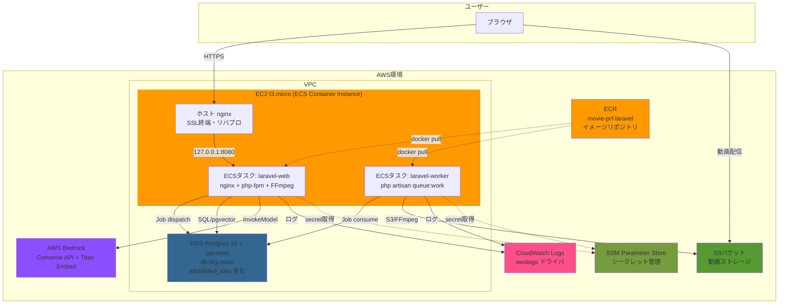
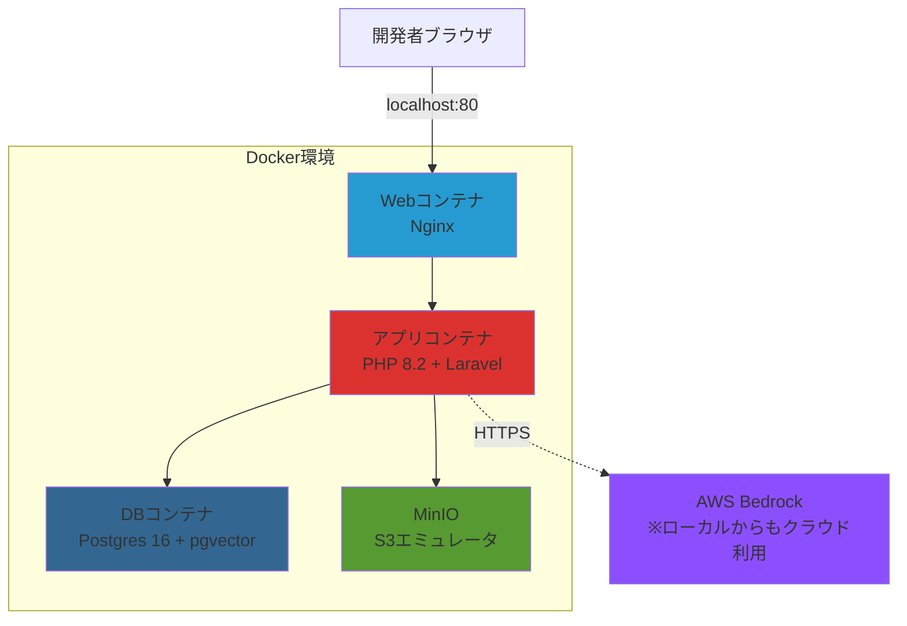
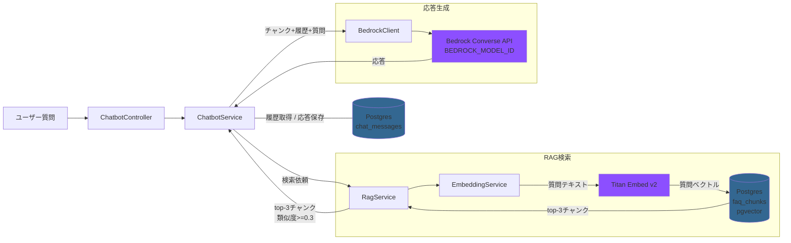

# アーキテクチャ設計書

## 技術スタック
- **フロントエンド**: Blade (Laravel標準テンプレートエンジン) + Tailwind CSS + Alpine.js
- **ビルドツール**: Vite
- **バックエンド**: Laravel 11.x + PHP 8.2
- **データベース**: PostgreSQL 16 + pgvector (アプリ本体・チャットボット共通の単一DB)
- **認証**: Laravel Breeze (標準認証パッケージ)
- **インフラ**: AWS (ECS on EC2 + ECR + S3 + RDS + Bedrock) + CloudFormation
  - Phase 7 で EC2 単体構成から ECS on EC2 起動タイプへ移行（詳細は `docs/plans/ecs_ecr_migration_phase1.md`）
  - EC2 上のホスト nginx が SSL 終端＋リバプロを担い、Docker コンテナで Laravel を実行
- **コンテナ**: Docker + ECS Task Definition（web タスク + worker タスクの 2 種）
- **ジョブキュー**: Laravel Queue（`database` ドライバ、PostgreSQL の `jobs` テーブル）
- **ローカル開発環境**: Docker + Docker Compose
- **動画処理**: FFmpeg（Phase 7 以降は worker タスクで Queue Job として非同期実行）
- **AI/LLM**: AWS Bedrock Converse API（LLMは `BEDROCK_MODEL_ID` で切替可能、既定 Amazon Nova Lite）+ Titan Embeddings v2
- **ライブラリ**: getID3（動画メタデータ取得）, @tailwindcss/forms（フォームスタイル）, aws/aws-sdk-php（Bedrock呼び出し）
- **テスト**: Pest（ユニット/フィーチャーテスト）, Playwright（E2Eテスト）
- **シークレット管理**: AWS Systems Manager Parameter Store（SecureString）
- **デプロイ**: ローカル PC のシェルスクリプト（`scripts/deploy-*.sh`）で ECR push + ECS update-service を実行（Phase 8 以降で GitHub Actions OIDC への切替を検討）
- **その他**: CloudWatch Logs（コンテナログを `awslogs` ドライバで集約）

## システム構成図

Phase 7（ECS化）以降の構成を示す。Laravel アプリケーションは ECS タスクとして起動し、EC2 上のホスト nginx が SSL 終端＋リバプロを担当する。

### ローカル開発環境構成

### チャットボット内部アーキテクチャ

> 注: `chat_messages` と `faq_chunks` は同一 PostgreSQL DB 内のテーブル。`faq_chunks` のみ pgvector 拡張を利用する。

## 選択理由

### フロントエンド
- **Blade + Tailwind CSS + Alpine.js**:
  - Laravelの標準テンプレートエンジンで学習コストが低い
  - シンプルなUIのため、フロントエンドフレームワーク（React/Vue）は不要
  - Tailwind CSSでレスポンシブデザインを効率的に実装
  - Alpine.jsで動画プレーヤーやモーダルなどの軽量なインタラクションを実装
  - Viteによる高速なアセットビルド
  - 個人開発のため、複雑なSPAは避けシンプルな構成に

### バックエンド
- **Laravel 11.x**:
  - 要件に明記された指定技術
  - 認証・ファイルアップロード・バリデーションが標準で充実
  - Eloquent ORMでデータベース操作が直感的
  - コミュニティが活発で情報が豊富

### データベース
- **PostgreSQL 16 + pgvector**:
  - アプリ本体（users, profiles, videos, chat_messages 等）とチャットボット RAG（faq_chunks）を単一 DB で管理
  - Laravel Eloquent / PDO pgsql で標準サポート
  - pgvector 拡張により埋め込みベクトル検索を同一 DB 内で完結（HNSW インデックス + コサイン類似度）
  - `chat_messages.user_id → users.id` の外部キー制約を RDBMS レベルで維持可能
  - RDS マネージド運用、1インスタンスで完結するためコスト・運用負荷が低い

### 認証
- **Laravel Breeze**:
  - Laravel公式の軽量認証スターターキット
  - ユーザー登録・ログイン・ログアウト機能が即座に実装可能
  - Bladeテンプレート対応
  - カスタマイズが容易

### インフラ
- **AWS EC2 (t3.micro) + ECS on EC2 起動タイプ**:
  - Phase 7 で EC2 単体配置から ECS Container Instance へ移行
  - 既存 EC2 を ECS クラスタに登録し、Docker コンテナで Laravel を実行
  - Fargate ではなく on EC2 を採用（月額 $30 予算堅持のため）
  - swap 2GiB を追加してメモリ逼迫を吸収（CloudWatch でスワップ使用率を監視）
  - 詳細: `docs/plans/ecs_ecr_migration_phase1.md`

- **AWS ECR**:
  - Laravel コンテナイメージのプライベートリポジトリ（`movie-prf-laravel`）
  - GitHub Actions（OIDC）が `docker buildx --push` で配信
  - ライフサイクル: untagged 7 日 expire、tagged 直近 10 個保持

- **AWS S3**:
  - 動画ファイルの保存・配信に最適
  - パブリック読み取りで直接配信
  - ストレージ容量の制限がなく、従量課金

- **AWS RDS (db.t4g.micro, PostgreSQL 16)**:
  - マネージド PostgreSQL で運用が簡単、pgvector 拡張も利用可能
  - 自動バックアップ機能（将来実装）
  - EC2と同一VPC内で安全な通信
  - アプリ本体とチャットボット RAG を 1 インスタンスで運用
  - Laravel Queue の `jobs` / `failed_jobs` テーブルも同一 DB に配置

- **AWS Systems Manager Parameter Store**:
  - DB パスワード、`APP_KEY`、Bedrock 認証情報等を SecureString で保管
  - ECS タスク定義の `secrets` から参照、Task Execution Role に `ssm:GetParameters` 付与
  - Secrets Manager（$0.40/secret/月）ではなく無料の Parameter Store を採用

- **CloudFormation**:
  - インフラをコードで管理（IaC）
  - ECR / ECS クラスタ / タスク定義 / IAM ロール / Parameter Store も IaC 化
  - 本番環境の構築・破棄が容易
  - パラメータで開発/本番環境を切り替え可能

- **ローカルデプロイスクリプト**:
  - Phase 7 は一人開発のため、GitHub Actions ではなくローカル PC から直接 `scripts/deploy-laravel.sh` 等を実行
  - 中身: `docker buildx --push :sha` → `aws ecs update-service --force-new-deployment` のローリングデプロイ
  - 複数人開発に移行する Phase 8 以降で GitHub Actions OIDC への切替を検討

### ローカル開発環境
- **Docker + Docker Compose**:
  - ローカル環境と本番環境の差異を最小化
  - チーム開発への拡張性（将来的に）
  - MinIOでS3をローカルエミュレート

### 動画処理
- **FFmpeg**:
  - オープンソースで無料
  - 多様な動画フォーマットに対応
  - Phase 1〜6: EC2 上の PHP プロセス内で同期実行
  - **Phase 7（ECS化）以降: Laravel Queue Job `EncodeVideoJob` として laravel-worker タスクで非同期実行**
  - Worker タスクは Web タスクと分離してデプロイ・スケール可能

### ジョブキュー
- **Laravel Queue (`database` ドライバ)**:
  - Phase 7 で導入。PostgreSQL の `jobs` / `failed_jobs` テーブルを利用
  - ECS rolling deploy や障害発生時もジョブ自体は DB に残るため失われない
  - Redis (ElastiCache) を採用しないことで月額コスト $9 を節約
  - 将来 Redis に切替する場合は `.env` の `QUEUE_CONNECTION=redis` 変更のみで対応可能

### 監視・ログ
- **CloudWatch Logs**:
  - Phase 6 までは EC2 上の CloudWatch Agent でログファイルを収集
  - **Phase 7 以降は ECS タスク定義の `awslogs` ドライバでコンテナの stdout/stderr を直接 CloudWatch Logs に送信**（ファイル経由廃止）
  - ロググループ: `/ecs/movie-prf/laravel-web`, `/ecs/movie-prf/laravel-worker`（retention 7 日）
  - 追加コストが最小限

### AI/LLM（チャットボット）
- **AWS Bedrock Converse API**:
  - 既存AWS環境とIAMで統一管理（アクセスキー方式）
  - Converse API によりモデル固有のリクエスト形式を意識せず、`BEDROCK_MODEL_ID` 一つで Amazon Nova・Anthropic Claude・Meta Llama 等へ差し替え可能
  - Anthropic 系モデルは AWS コンソールで Use Case Details 申請が必要、Inference Profile（`jp.` / `apac.` プレフィックス）経由で利用
  - 東京リージョン対応で低レイテンシ

- **LLM（既定: Amazon Nova Lite `amazon.nova-lite-v1:0`）**:
  - Claude Haikuの1/10以下の料金（入力$0.06/1M、出力$0.24/1M）
  - 日本語FAQ回答には十分な品質
  - Function Calling対応（Phase 2でTool Use活用時）

- **Amazon Titan Embeddings v2**:
  - 1024次元ベクトル、日本語対応
  - Bedrockで統一管理
  - 埋め込み料金 $0.02/1M トークンと安価

### チャットボット用 pgvector
- **PostgreSQL pgvector 拡張**:
  - RAG実装の業界標準
  - HNSWインデックスで高速な近似最近傍検索
  - アプリ本体と同一 DB 内で `faq_chunks` テーブルのみ `CREATE EXTENSION vector` を適用
  - 別インスタンスを立てないため、本番 RDS インスタンスは 1 系統で済む

## 初期コスト（月額）

### 本番環境（AWS、Phase 7 ECS化後）
- **EC2 (t3.micro)**: $7.50/月（ECS Container Instance として継続利用）
- **ECS (コントロールプレーン)**: $0/月（AWS が無料提供、EC2 起動タイプも Fargate も同様）
- **RDS Postgres 16 + pgvector (db.t4g.micro)**: $12.50/月（アプリ本体・チャットボット共通、jobs/failed_jobs テーブル含む）
- **ECR**: $0〜$1.00/月（500MB まで無料、超過後 $0.10/GB）
- **SSM Parameter Store (Standard)**: $0/月（無料）
- **S3ストレージ**: $1.00/月（想定: 動画50GB程度）
- **S3データ転送**: $1.00/月（想定: 100GB転送）
- **CloudWatch Logs**: $0.50/月（retention 7 日、合計 1GB 想定）
- **Bedrock (Converse API + Titan)**: $1.00〜$3.00/月（100ユーザー×50QA想定、Nova Lite 既定）
- **合計**: **$23.50〜$26.50/月**

### 開発環境
- ローカル開発: $0（Docker使用）

### 備考
- 上記は想定コストで、実際の使用量により変動
- 月額目標$30以下を達成可能
- 開発中はEC2/RDSを停止してコスト削減
- 無料利用枠（初年度）があればさらに削減可能
- Phase 8（ALB 追加 + オートスケーリング）導入時は ALB $16/月 + 2 台目 EC2 $7.5/月 ≈ +$24/月の増加が見込まれる

## セキュリティ基盤

### SecurityHeadersMiddleware
全HTTPレスポンスに以下のセキュリティヘッダーを自動付与するカスタムミドルウェアを実装:

| ヘッダー | 値 | 目的 |
|---------|-----|------|
| X-XSS-Protection | 1; mode=block | XSS攻撃のブラウザ側検出・ブロック |
| X-Content-Type-Options | nosniff | MIMEタイプスニッフィングの防止 |
| X-Frame-Options | SAMEORIGIN | クリックジャッキングの防止 |
| Referrer-Policy | strict-origin-when-cross-origin | リファラー情報の制御 |
| Permissions-Policy | camera=(), microphone=(), geolocation() | ブラウザ機能へのアクセス制限 |
| Strict-Transport-Security | max-age=31536000; includeSubDomains | HTTPS通信の強制（HTTPS使用時のみ） |

---

## 将来の拡張性

### Phase 7（実施中・本フェーズ）
- **ECS on EC2 + ECR**: コンテナ運用化（Web タスク + Worker タスク）
- **動画エンコード Queue Job 化**: `EncodeVideoJob` で非同期化、Web リクエストをブロックしない
- **ローカルデプロイスクリプト**: `scripts/deploy-*.sh` で ECR push + ECS update-service を実行（GitHub Actions は Phase 8 以降で必要に応じて導入）
- **AWS リソースは AWS マネジメントコンソールで構築**（CloudFormation 等の IaC 化は Phase 8 以降）
- **CloudWatch Logs `awslogs` 統合**: コンテナログ集約
- **EC2 ホスト直接運用への fallback も維持**（ハイブリッド方式、`docs/operations/ec2_fallback.md`）。Queue Job 化したコードは ECS でも EC2 ホスト上の systemd でも動かせる
- 詳細: `docs/plans/ecs_ecr_migration_phase1.md`

### Phase 8（ECS 化後の発展）
- **ALB**: ホスト nginx を ALB に置き換え、SSL 終端を ACM へ
- **オートスケーリング**: ECS Service の `desiredCount` を CPU 使用率に応じて自動増減
- **Capacity Provider + Auto Scaling Group**: コンテナインスタンス自体の自動増減
- 想定追加コスト: ALB $16/月 + 2 台目 EC2 $7.5/月 ≈ $24/月（予算超のため別途判断）

### Phase 9（さらなるマネージド化）
- **Fargate 移行**: EC2 管理を完全に廃止、Spot Fargate で最大 70% 削減
- **CloudFront**: 動画配信に CDN を導入（Node.js 版 SPA は Phase 7 で先行対応）
- **ElastiCache**: Queue/Session を Redis に切替、`database` ドライバから移行
- **RDS マルチ AZ**: 可用性向上（コスト増加）

### スケーラビリティ
- ECS タスクの `desiredCount` 変更で水平スケール
- Auto Scaling で負荷に応じた自動スケール（Phase 8 以降）
- S3 は自動的にスケール
- Worker タスクと Web タスクを独立スケール可能
