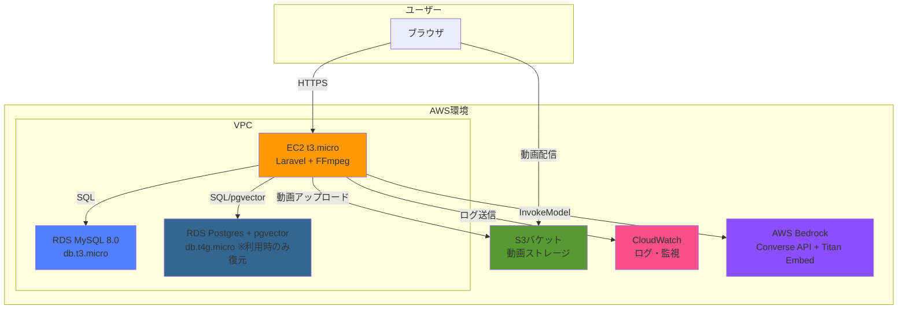
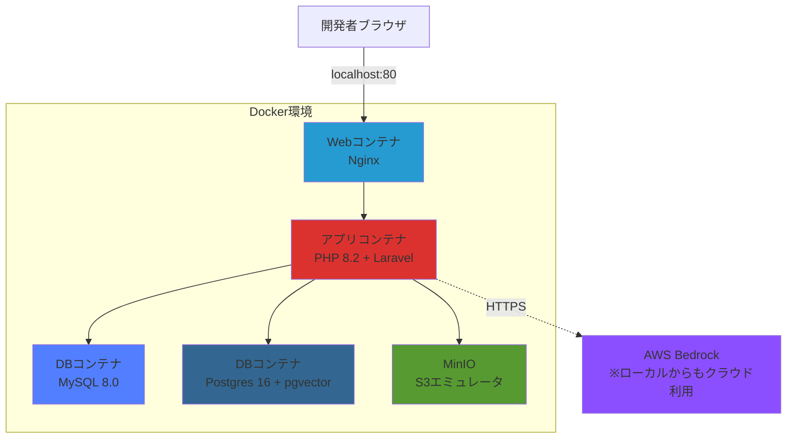
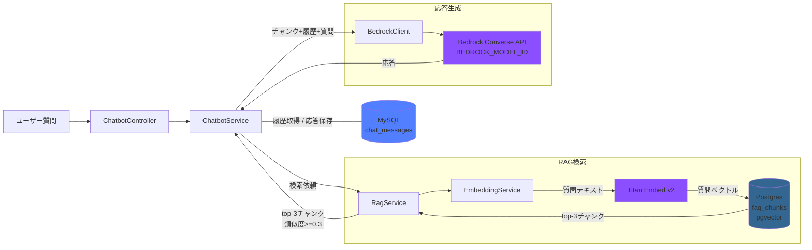

# アーキテクチャ設計書

## 技術スタック
- **フロントエンド**: Blade (Laravel標準テンプレートエンジン) + Tailwind CSS + Alpine.js
- **ビルドツール**: Vite
- **バックエンド**: Laravel 11.x + PHP 8.2
- **データベース**: MySQL 8.0 (アプリ本体) / PostgreSQL 16 + pgvector (チャットボット専用)
- **認証**: Laravel Breeze (標準認証パッケージ)
- **インフラ**: AWS (EC2 + S3 + RDS + Bedrock) + CloudFormation
- **ローカル開発環境**: Docker + Docker Compose
- **動画処理**: FFmpeg
- **AI/LLM**: AWS Bedrock Converse API（LLMは `BEDROCK_MODEL_ID` で切替可能、既定 Amazon Nova Lite）+ Titan Embeddings v2
- **ライブラリ**: getID3（動画メタデータ取得）, @tailwindcss/forms（フォームスタイル）, aws/aws-sdk-php（Bedrock呼び出し）
- **テスト**: Pest（ユニット/フィーチャーテスト）, Playwright（E2Eテスト）
- **その他**: CloudWatch (監視・ログ)

## システム構成図

### ローカル開発環境構成

### チャットボット内部アーキテクチャ

## 選択理由

### フロントエンド
- **Blade + Tailwind CSS + Alpine.js**:
  - Laravelの標準テンプレートエンジンで学習コストが低い
  - シンプルなUIのため、フロントエンドフレームワーク（React/Vue）は不要
  - Tailwind CSSでレスポンシブデザインを効率的に実装
  - Alpine.jsで動画プレーヤーやモーダルなどの軽量なインタラクションを実装
  - Viteによる高速なアセットビルド
  - 個人開発のため、複雑なSPAは避けシンプルな構成に

### バックエンド
- **Laravel 11.x**:
  - 要件に明記された指定技術
  - 認証・ファイルアップロード・バリデーションが標準で充実
  - Eloquent ORMでデータベース操作が直感的
  - コミュニティが活発で情報が豊富

### データベース
- **MySQL 8.0**:
  - 要件に明記された指定技術
  - Laravelとの相性が良い
  - RDSで簡単にマネージド運用可能
  - 小規模アプリケーションには十分な性能

### 認証
- **Laravel Breeze**:
  - Laravel公式の軽量認証スターターキット
  - ユーザー登録・ログイン・ログアウト機能が即座に実装可能
  - Bladeテンプレート対応
  - カスタマイズが容易

### インフラ
- **AWS EC2 (t3.micro)**:
  - LaravelアプリケーションとFFmpegを同居させる
  - 低コストで運用可能
  - 将来的なスケールアップも容易

- **AWS S3**:
  - 動画ファイルの保存・配信に最適
  - パブリック読み取りで直接配信
  - ストレージ容量の制限がなく、従量課金

- **AWS RDS (db.t3.micro)**:
  - マネージドMySQLで運用が簡単
  - 自動バックアップ機能（将来実装）
  - EC2と同一VPC内で安全な通信

- **CloudFormation**:
  - インフラをコードで管理（IaC）
  - 本番環境の構築・破棄が容易
  - パラメータで開発/本番環境を切り替え可能

### ローカル開発環境
- **Docker + Docker Compose**:
  - ローカル環境と本番環境の差異を最小化
  - チーム開発への拡張性（将来的に）
  - MinIOでS3をローカルエミュレート

### 動画処理
- **FFmpeg**:
  - オープンソースで無料
  - 多様な動画フォーマットに対応
  - EC2上で実行（Phase 1）
  - 将来的にLambda化を検討（Phase 2）

### 監視・ログ
- **CloudWatch**:
  - AWS標準の監視サービス
  - ログ収集とアラート設定が可能
  - 追加コストが最小限

### AI/LLM（チャットボット）
- **AWS Bedrock Converse API**:
  - 既存AWS環境とIAMで統一管理（アクセスキー方式）
  - Converse API によりモデル固有のリクエスト形式を意識せず、`BEDROCK_MODEL_ID` 一つで Amazon Nova・Anthropic Claude・Meta Llama 等へ差し替え可能
  - Anthropic 系モデルは AWS コンソールで Use Case Details 申請が必要、Inference Profile（`jp.` / `apac.` プレフィックス）経由で利用
  - 東京リージョン対応で低レイテンシ

- **LLM（既定: Amazon Nova Lite `amazon.nova-lite-v1:0`）**:
  - Claude Haikuの1/10以下の料金（入力$0.06/1M、出力$0.24/1M）
  - 日本語FAQ回答には十分な品質
  - Function Calling対応（Phase 2でTool Use活用時）

- **Amazon Titan Embeddings v2**:
  - 1024次元ベクトル、日本語対応
  - Bedrockで統一管理
  - 埋め込み料金 $0.02/1M トークンと安価

### チャットボット用データベース
- **PostgreSQL 16 + pgvector**:
  - RAG実装の業界標準
  - HNSWインデックスで高速な近似最近傍検索
  - MySQLとは別インスタンスで分離（アプリ本体への影響ゼロ）
  - 本番はスナップショット運用（利用時のみ復元）でコスト抑制

## 初期コスト（月額）

### 本番環境（AWS）
- **EC2 (t3.micro)**: $7.50/月
- **RDS MySQL (db.t3.micro)**: $12.50/月
- **RDS Postgres (db.t4g.micro)**: $2.00/月（※スナップショット運用、利用時のみ復元）
- **S3ストレージ**: $1.00/月（想定: 動画50GB程度）
- **S3データ転送**: $1.00/月（想定: 100GB転送）
- **CloudWatch**: $2.00/月（ログ・メトリクス）
- **Bedrock (Converse API + Titan)**: $1.00〜$3.00/月（100ユーザー×50QA想定、Nova Lite 既定）
- **合計**: **$27.00〜$29.00/月**

### 開発環境
- ローカル開発: $0（Docker使用）

### 備考
- 上記は想定コストで、実際の使用量により変動
- 月額目標$30以下を達成可能
- 開発中はEC2/RDSを停止してコスト削減
- 無料利用枠（初年度）があればさらに削減可能

## セキュリティ基盤

### SecurityHeadersMiddleware
全HTTPレスポンスに以下のセキュリティヘッダーを自動付与するカスタムミドルウェアを実装:

| ヘッダー | 値 | 目的 |
|---------|-----|------|
| X-XSS-Protection | 1; mode=block | XSS攻撃のブラウザ側検出・ブロック |
| X-Content-Type-Options | nosniff | MIMEタイプスニッフィングの防止 |
| X-Frame-Options | SAMEORIGIN | クリックジャッキングの防止 |
| Referrer-Policy | strict-origin-when-cross-origin | リファラー情報の制御 |
| Permissions-Policy | camera=(), microphone=(), geolocation() | ブラウザ機能へのアクセス制限 |
| Strict-Transport-Security | max-age=31536000; includeSubDomains | HTTPS通信の強制（HTTPS使用時のみ） |

---

## 将来の拡張性

### Phase 2での改善案
- **CloudFront**: S3の前段にCDNを配置し、動画配信を高速化
- **ECS + Lambda**: 非同期エンコード処理に移行
- **ElastiCache**: セッション管理やキャッシュに利用
- **RDS自動バックアップ**: データ保護の強化
- **マルチAZ構成**: 可用性向上（コスト増加）

### スケーラビリティ
- EC2のインスタンスタイプ変更でスケールアップ
- Auto Scalingで負荷に応じた自動スケール（将来）
- S3は自動的にスケール
