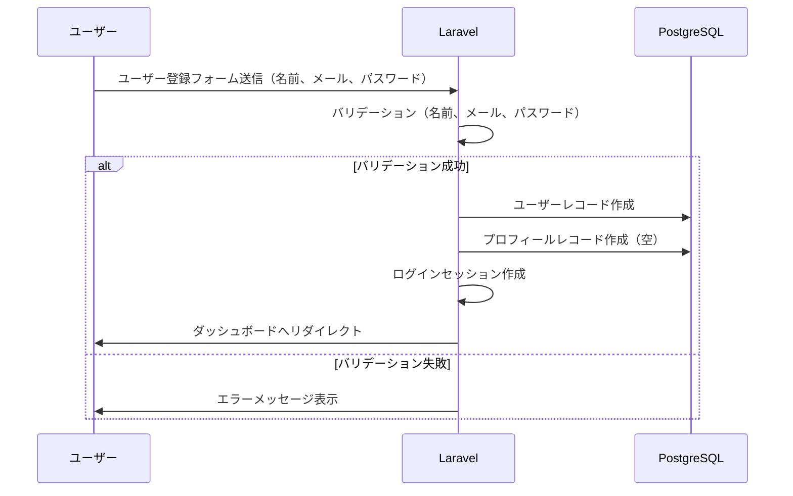
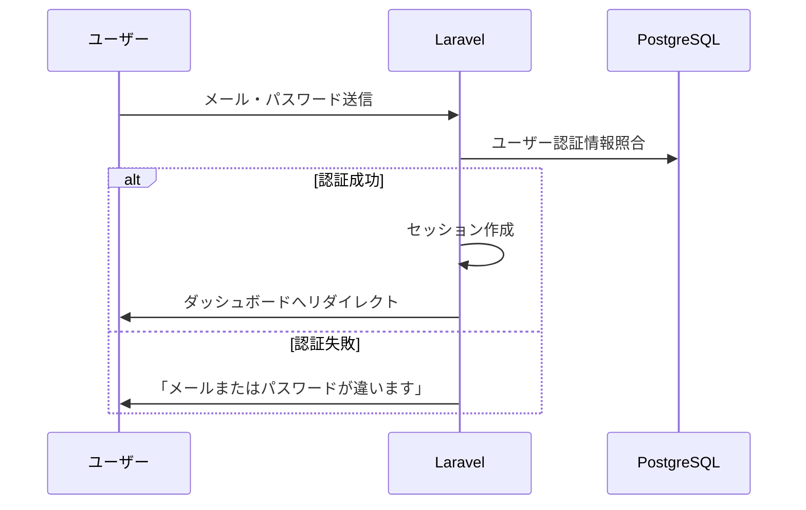
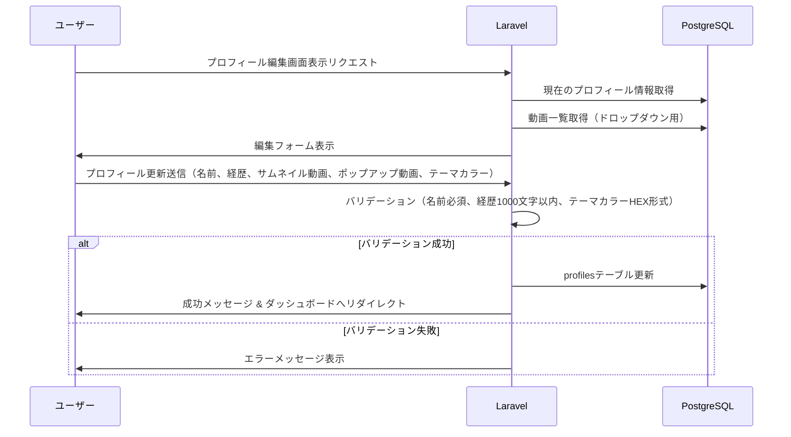
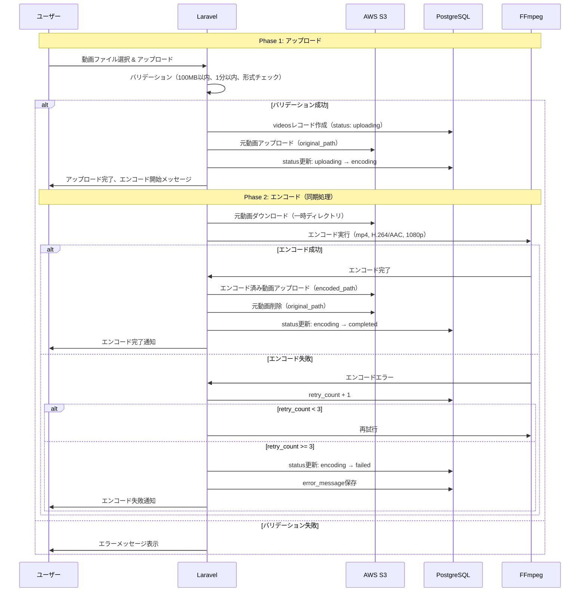
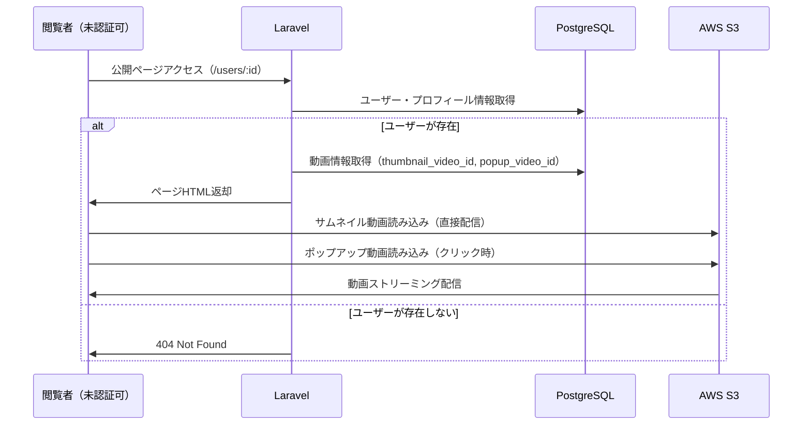
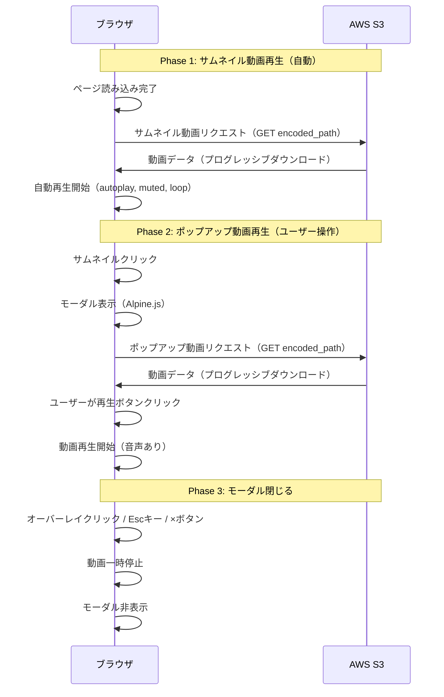
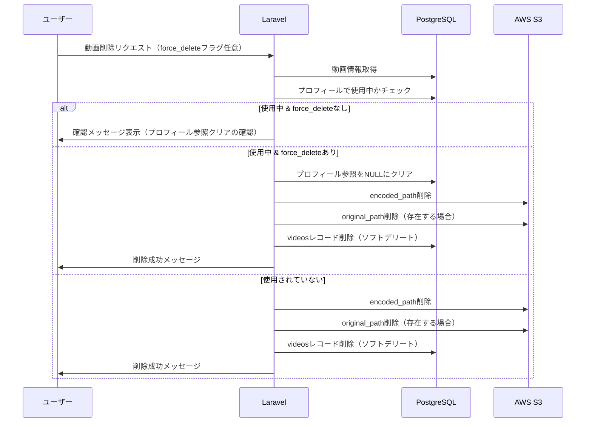
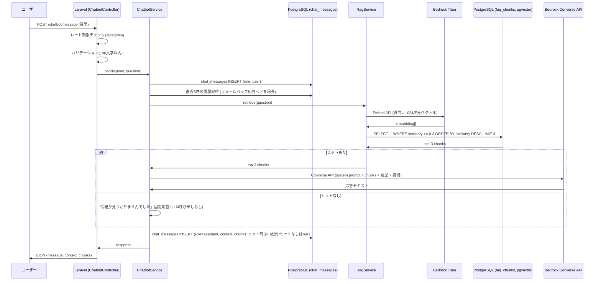
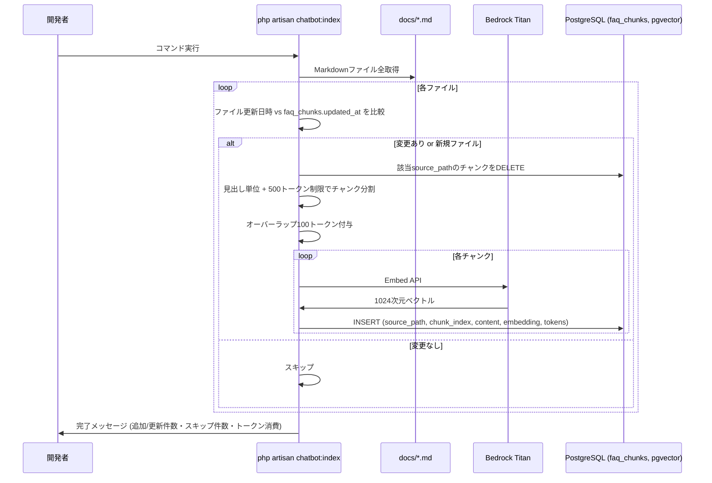

# データフロー設計書

## 主要フロー図

### 1. ユーザー登録フロー

### 2. ログインフロー

### 3. プロフィール編集フロー

### 4. 動画アップロード・エンコードフロー（重要）

### 5. 公開ページ閲覧フロー

### 5-1. 動画再生フロー（詳細）

#### 動画再生フロー詳細

**サムネイル動画の読み込みタイミング**:
1. ブラウザがページHTMLを受信
2. `<video>` タグを解析
3. `preload="metadata"` でメタデータのみ先読み
4. `autoplay` 属性により自動的に再生開始
5. `loop` 属性により終了後も繰り返し再生

**ポップアップ動画の読み込みタイミング**:
1. 初期状態: `preload="none"` で読み込みなし
2. モーダル表示時にブラウザが動画読み込みを開始
3. ユーザーが再生ボタンをクリックして再生開始
4. モーダルを閉じると動画は一時停止（メモリに保持）

**パフォーマンス考慮**:
- サムネイル動画: メタデータのみ先読みで初期読み込みを軽量化
- ポップアップ動画: 遅延読み込みでページ初期表示を高速化
- S3から直接配信（CDNは将来Phase 2で導入）

### 6. 動画削除フロー

### 7. チャットボット質問応答フロー

### 8. FAQインデックス化フロー

## フロー詳細

### ユーザー登録フロー
**トリガー**: ユーザーが登録フォームを送信
**処理ステップ**:
1. Laravel側でバリデーション（名前必須、メール形式、パスワード8文字以上）
2. パスワードをbcryptでハッシュ化
3. `users`テーブルにレコード挿入（name, email, password, role: user）
4. `profiles`テーブルに空のレコード挿入（user_idで紐付け）
5. ログインセッション作成
6. ダッシュボードへリダイレクト

**成功時**: ダッシュボードが表示され、プロフィール編集が可能
**失敗時**: エラーメッセージを表示し、フォームに戻る

---

### ログインフロー
**トリガー**: ユーザーがログインフォームを送信
**処理ステップ**:
1. メールアドレスとパスワードを受け取る
2. `users`テーブルから該当ユーザーを検索
3. パスワードハッシュを照合
4. Remember Meがチェックされていればトークン保存
5. セッションにユーザー情報を保存
6. ダッシュボードへリダイレクト

**成功時**: ダッシュボードへ遷移
**失敗時**: 「メールアドレスまたはパスワードが正しくありません」を表示

---

### プロフィール編集フロー
**トリガー**: ユーザーがプロフィール編集フォームを送信
**処理ステップ**:
1. 名前、経歴、サムネイル動画ID、ポップアップ動画ID、テーマカラーを受け取る
2. バリデーション（名前: 必須50文字以内、経歴: 任意1000文字以内、テーマカラー: HEX形式必須）
3. 選択された動画IDが自分の動画かチェック
4. `profiles`テーブルを更新
5. 公開プロフィールキャッシュをクリア（`Cache::forget()`）
6. 成功メッセージと共にダッシュボードへリダイレクト

**成功時**: 「プロフィールを更新しました」とメッセージ表示
**失敗時**: バリデーションエラーをフォームに表示

---

### 動画アップロード・エンコードフロー
**トリガー**: ユーザーが動画ファイルをアップロード
**処理ステップ**:

#### アップロード段階
1. ファイルバリデーション
   - ファイルサイズ: 100MB以内
   - 動画の長さ: 1分（60秒）以内
   - 対応フォーマット: mp4, mov, avi, wmv
2. `videos`テーブルにレコード作成（status: uploading）
3. S3に元動画アップロード（パス: `users/{user_id}/original/{video_id}.{ext}`）
4. status更新: `uploading` → `encoding`

#### エンコード段階（同期処理 Phase 1）
5. S3から元動画をダウンロード（EC2のtmpディレクトリ）
6. FFmpegでエンコード実行
   - 出力形式: mp4 (H.264 video / AAC audio)
   - 最大解像度: 1080p
   - タイムアウト: 5分
7. エンコード成功時:
   - エンコード済み動画をS3にアップロード（パス: `users/{user_id}/encoded/{video_id}.mp4`）
   - 元動画をS3から削除
   - status更新: `encoding` → `completed`
8. エンコード失敗時:
   - `retry_count` をインクリメント
   - retry_count < 3 ならリトライ
   - retry_count >= 3 なら status更新: `encoding` → `failed`
   - エラーメッセージを `error_message` に保存

**成功時**: ユーザーに「動画のエンコードが完了しました」と通知
**失敗時**: 「動画のエンコードに失敗しました。別の動画をお試しください」と通知

---

### 公開ページ閲覧フロー
**トリガー**: 未認証/認証ユーザーが `/users/:id` にアクセス
**処理ステップ**:
1. URLパラメータからユーザーIDを取得
2. `users`テーブルと`profiles`テーブルをJOINして情報取得
3. `thumbnail_video_id`と`popup_video_id`から動画情報を取得
4. ページHTMLを生成して返却
5. ブラウザ側でS3の動画URLから直接ストリーミング再生

**成功時**: プロフィールページを表示、動画が自動再生（サムネイル）
**失敗時**: ユーザーが存在しない場合は404エラーページ

---

### 動画削除フロー
**トリガー**: ユーザーが動画管理ページで削除ボタンをクリック
**処理ステップ**:
1. 削除対象の動画情報を取得
2. プロフィールの`thumbnail_video_id`または`popup_video_id`で使用中かチェック
3. `force_delete` フラグの有無で処理分岐:
   - **`force_delete` なし**: 使用中の場合は確認メッセージを表示
   - **`force_delete` あり**: プロフィール参照（`thumbnail_video_id`、`popup_video_id`）をNULLにクリアしてから削除続行
4. 削除処理:
   - S3から`encoded_path`の動画を削除
   - S3から`original_path`の動画を削除（存在する場合）
   - `videos`テーブルからレコード削除（ソフトデリート）

**成功時**: 「動画を削除しました」とメッセージ表示
**失敗時**: 「この動画はプロフィールで使用中のため削除できません」と表示（`force_delete` なし時）

---

### チャットボット質問応答フロー
**トリガー**: ユーザーがチャットウィジェットで質問送信
**処理ステップ**:
1. レート制限チェック（10req/min per user）
2. バリデーション（auth middleware、100文字以内）
3. ユーザー質問を `chat_messages` に保存（role=user）
4. 直近5件の履歴を `chat_messages` から取得（マルチターン文脈用）
   - フォールバック応答（`context_chunks IS NULL`）と、その直前のユーザー質問をペアで除外
   - 回答できなかった会話がLLMの次回応答に混ざるのを防ぐ
5. 質問を Titan Embeddings v2 でベクトル化（1024次元）
6. Postgres pgvector でコサイン類似度検索（類似度 >= 0.3 のチャンクを top-3 取得）
7. ヒットあり: top-3 をコンテキストとして Bedrock Converse API に送信（モデルは `BEDROCK_MODEL_ID` で設定）
8. ヒットなし: 「情報が見つかりませんでした」の固定応答（LLMは呼び出さない）
9. 応答を `chat_messages` に保存（role=assistant、ヒット時は context_chunks に参照ID記録、ヒットなしは null）
10. JSON で応答を返却

**成功時**: ユーザーに回答が表示
**失敗時**: 「一時的にエラーが発生しました」と表示、ログに詳細記録

---

### FAQインデックス化フロー
**トリガー**: `php artisan chatbot:index` コマンド実行（開発者が手動 or 定期実行）

**実行モード**:
- **差分更新モード（引数なし）**: `docs/` 配下の全 `.md` ファイルを走査し、ファイルの mtime が `faq_chunks.updated_at` より新しいファイルのみ再インデックス
- **個別指定モード（`--path=xxx.md`）**: 指定ファイルのみインデックス化（差分判定はせず常に再生成）
- **全再生成モード（`--fresh`）**: `faq_chunks` 全件 DELETE 後、全 `.md` を再インデックス

**処理ステップ（対象ファイルごと）**:
1. ファイル内容を読み込み、Markdown を見出し(`##`)単位で分割
2. 長いセクションは500トークンごとに分割、前後100トークンをオーバーラップ
3. 既存の同 `source_path` チャンクを DELETE
4. 各チャンクに対して Bedrock Titan Embeddings API を呼び出し
5. `(source_path, chunk_index, content, embedding, tokens, updated_at)` を Postgres `faq_chunks` に INSERT
6. 完了時にチャンク数・総トークン消費・スキップファイル数を表示

**差分判定ロジック**: 各ファイルについて、`faq_chunks` に該当 `source_path` の行がない、または最新の `updated_at` が `filemtime()` より古ければ再インデックス対象
**典型的な処理時間**: 300チャンクで約5〜10分（Bedrockレート制限依存）。差分更新時は変更ファイル数に比例

---

## 外部連携

### AWS S3
- **連携内容**: 動画ファイルのストレージ・配信
- **データ形式**: 動画ファイル（mp4, mov, avi, wmv等）
- **アップロードパス**:
  - 元動画: `users/{user_id}/original/{video_id}.{ext}`
  - エンコード済み: `users/{user_id}/encoded/{video_id}.mp4`
- **アクセス権限**: パブリック読み取り可（直接配信のため）
- **エラー処理**:
  - アップロード失敗時: 3回までリトライ、失敗時はユーザーに通知
  - ダウンロード失敗時: エンコードを中止し、エラーステータスに更新

---

### FFmpeg（動画エンコード）
- **連携内容**: 動画フォーマット変換（Phase 1: EC2上で同期実行）
- **入力形式**: mp4, mov, avi, wmv等の一般的な動画フォーマット
- **出力形式**: mp4 (H.264 video / AAC audio)
- **エンコード設定**:
  - 最大解像度: 1080p
  - ビットレート: 自動調整
  - タイムアウト: 5分
- **エラー処理**:
  - エンコード失敗時: 最大3回リトライ
  - 3回失敗後: status を `failed` に更新、error_messageを保存
  - ユーザーに失敗通知を表示

---

### AWS Bedrock（LLM / 埋め込み）
- **連携内容**: チャットボットの回答生成・ベクトル化
- **使用モデル**:
  - LLM: `.env` の `BEDROCK_MODEL_ID` で切替可能（既定: `amazon.nova-lite-v1:0`）。Bedrock Converse API を使用しているため、Anthropic Claude・Amazon Nova・Meta Llama 等のモデル間差し替えはコード変更不要
  - 埋め込み: `BEDROCK_EMBED_MODEL_ID`（既定: `amazon.titan-embed-text-v2:0`、1024次元）
- **認証**: アクセスキー方式（`BEDROCK_ACCESS_KEY_ID` / `BEDROCK_SECRET_ACCESS_KEY`）。IAMポリシーで `bedrock:InvokeModel` 権限付与
- **リージョン**: `ap-northeast-1`（東京）。Claude 等一部モデルは Inference Profile（`jp.` / `apac.` プレフィックス）経由で利用
- **タイムアウト**: 10秒
- **エラー処理**:
  - スロットリング時: 指数バックオフで3回リトライ
  - 致命的エラー時: ユーザーに汎用エラーメッセージ、詳細はCloudWatchに記録
  - Anthropic系モデルは AWS コンソールで Use Case Details 申請が必要。未申請時は `ResourceNotFoundException` になるため、ログで検知して汎用エラー応答

---

### PostgreSQL + pgvector（アプリ本体・チャットボット共通DB）
- **連携内容**: アプリケーションデータの永続化、およびチャットボット RAG のベクトル検索
- **接続**: Laravel の `pgsql` 接続（default、`config/database.php`）
- **主要テーブル**: users, profiles, videos, chat_messages, faq_chunks
- **接続方式**: Laravel Eloquent ORM（RAG の類似度検索のみ生 SQL）
- **pgvector**:
  - `faq_chunks` テーブルで `vector(1024)` 型 + HNSW インデックス（`vector_cosine_ops`）を利用
  - 検索クエリ: `1 - (embedding <=> $queryVec)` を類似度として算出し、`>= 0.3` のチャンクを `ORDER BY similarity DESC LIMIT 3` で取得
- **トランザクション管理**:
  - ユーザー登録時: users + profiles を同時作成（トランザクション）
  - 動画削除時: videos削除 + S3削除（エラー時はロールバック）
- **エラー処理**:
  - 接続エラー: アプリケーションエラーページ表示（RAG のみ失敗時は「情報が見つかりませんでした」に fallback）
  - クエリエラー: ログに記録し、ユーザーに汎用エラーメッセージ表示

---

## 補足事項

### エンコード処理の注意点
- **Phase 1**: EC2上で同期処理のため、1件ずつ順次処理
- **同時エンコード**: 複数ユーザーが同時アップロードした場合、キューで順番待ち
- **タイムアウト**: エンコードが5分を超えた場合は処理中断
- **リソース監視**: CloudWatchでEC2のCPU使用率を監視

### Phase 2での改善予定
- **非同期エンコード**: ECS + Lambda に移行し、並列処理を可能に
- **プログレス表示**: WebSocketでエンコード進捗をリアルタイム通知
- **CDN配信**: CloudFrontを導入し、S3の前段でキャッシュ

### キャッシュ機構
- **公開プロフィール**: `Cache::remember()` でプロフィール情報を5分間キャッシュ
- **キャッシュクリア**: プロフィール更新時に `Cache::forget()` で該当ユーザーのキャッシュを無効化
- **キャッシュキー**: `public_profile_{user_id}` 形式

### セキュリティ考慮事項
- **CSRF対策**: Laravel標準のCSRFトークンで保護
- **認証チェック**: ミドルウェアで未認証ユーザーのアクセス制限
- **動画所有権チェック**: 他人の動画を削除・編集できないよう検証
- **S3署名付きURL**: 将来的にプライベート動画対応時に導入検討
