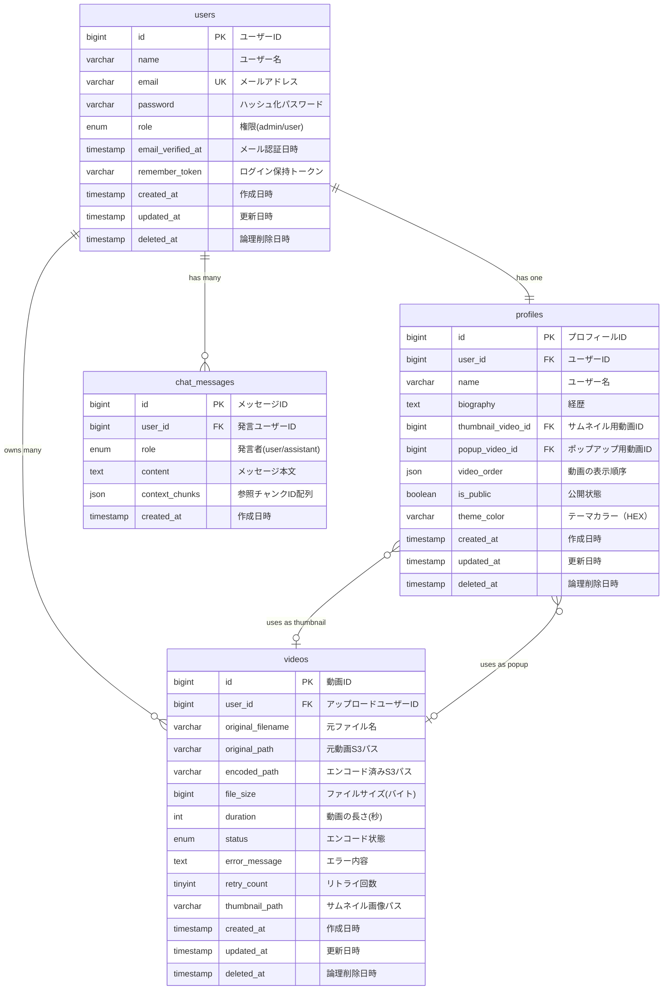
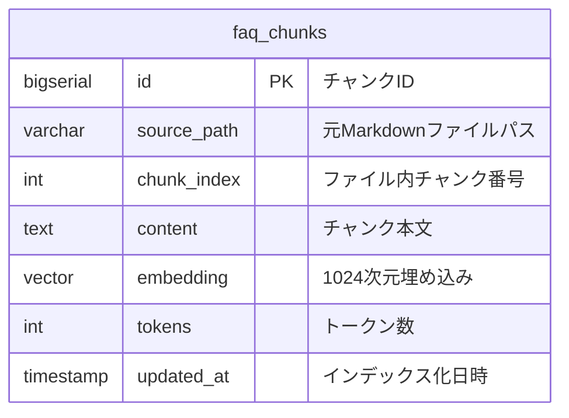

# ER図設計書

## ER図



### Postgres側 ER図（独立DB・参考）



## エンティティ定義

### users（ユーザー）
- **説明**: ユーザーの認証情報を管理するエンティティ
- **主キー**: `id`
- **主要属性**:
  - `name`: ユーザー名（Laravel Breeze標準のユーザー名フィールド）
  - `email`: ログイン用メールアドレス（一意制約）
  - `password`: bcryptでハッシュ化されたパスワード
  - `role`: ユーザー権限（admin: 管理者, user: 一般ユーザー）
  - `deleted_at`: ソフトデリート用タイムスタンプ（30日後に物理削除）

**備考**:
- Laravel標準の認証テーブル構成に準拠（Breeze標準で`name`フィールドを含む）
- `email_verified_at` はPhase 2でメール認証機能実装時に使用
- `remember_token` はログイン状態保持機能で使用

---

### profiles（プロフィール）
- **説明**: ユーザーの公開プロフィール情報を管理するエンティティ
- **主キー**: `id`
- **外部キー**:
  - `user_id`: usersテーブルへの外部キー（1対1）
  - `thumbnail_video_id`: videosテーブルへの外部キー（任意）
  - `popup_video_id`: videosテーブルへの外部キー（任意）
- **主要属性**:
  - `name`: 公開ページに表示される名前（必須、50文字以内）
  - `biography`: 経歴テキスト（任意、1000文字以内）
  - `thumbnail_video_id`: サムネイル用動画（円形表示、自動ループ）
  - `popup_video_id`: ポップアップ用動画（サムネイルクリック時にカード内フルカード展開、音声あり）
  - `video_order`: 動画の表示順序（JSON配列、任意）
  - `is_public`: プロフィール公開状態（デフォルト: 公開）
  - `theme_color`: 公開ページのカード枠・サムネイル枠に反映されるテーマカラー（HEX形式、デフォルト: #667eea）

**備考**:
- 1ユーザーに1プロフィール（1対1リレーション）
- 動画IDは任意（NULLを許可）
- ユーザー削除時にカスケード削除
- `deleted_at` はソフトデリート用（Laravel SoftDeletesトレイト）

---

### videos（動画）
- **説明**: アップロードされた動画ファイルとエンコード状態を管理するエンティティ
- **主キー**: `id`
- **外部キー**:
  - `user_id`: usersテーブルへの外部キー（動画の所有者）
- **主要属性**:
  - `original_filename`: ユーザーがアップロードした元のファイル名
  - `original_path`: S3に保存された元動画のパス（エンコード完了後に削除）
  - `encoded_path`: エンコード後の動画S3パス（公開配信用）
  - `file_size`: 動画ファイルサイズ（バイト単位）
  - `duration`: 動画の長さ（秒、60秒以内制限）
  - `status`: エンコード処理の状態（uploading, encoding, completed, failed）
  - `error_message`: エンコード失敗時のエラー詳細
  - `retry_count`: エンコードリトライ回数（最大3回）
  - `thumbnail_path`: 動画のサムネイル画像パス（任意）
  - `deleted_at`: ソフトデリート用タイムスタンプ（Laravel SoftDeletesトレイト）

**備考**:
- 1ユーザーが複数動画を所有可能（1対多リレーション）
- ユーザー削除時にカスケード削除（S3ファイルも削除）
- statusのENUM値: `uploading`, `encoding`, `completed`, `failed`
- ソフトデリート対応（`deleted_at`）

---

### chat_messages（チャットボット会話履歴・MySQL側）
- **説明**: ユーザーとチャットボットの会話履歴を追記保存するエンティティ
- **主キー**: `id`
- **外部キー**: `user_id` → `users.id`
- **主要属性**:
  - `role`: 発言者ロール（`user` or `assistant`）
  - `content`: メッセージ本文
  - `context_chunks`: ボット応答時に参照したFAQチャンクIDの配列(JSON)
- **備考**:
  - 追記のみ（`updated_at` / `deleted_at` を持たない）
  - ユーザー削除時はカスケード削除

---

### faq_chunks（FAQチャンク・Postgres側）
- **説明**: チャットボットのRAG用知識源。Markdownドキュメントをチャンク化した埋め込みベクトルを保持
- **主キー**: `id` (BIGSERIAL)
- **備考**:
  - MySQLとは別DBインスタンス（`pgsql_chatbot` 接続）
  - pgvector拡張機能を使用（`VECTOR(1024)` 型）
  - HNSWインデックスで近似最近傍検索を高速化
  - アプリ本体DBとFK関係を持たない（疎結合、`chat_messages.context_chunks`で参照追跡）

---

## リレーション定義

| エンティティA | 関係 | エンティティB | カーディナリティ | 説明 |
|--------------|------|--------------|-----------------|------|
| users | 1:1 | profiles | 1ユーザー : 1プロフィール | ユーザー登録時に空のプロフィールを自動作成。ユーザー削除時はプロフィールもカスケード削除 |
| users | 1:N | videos | 1ユーザー : 複数動画 | ユーザーは複数の動画をアップロード可能。ユーザー削除時は動画もカスケード削除（S3ファイルも削除） |
| users | 1:N | chat_messages | 1ユーザー : 複数メッセージ | チャットボット会話履歴。ユーザー削除時はカスケード削除 |
| profiles | N:1 | videos (thumbnail) | 複数プロフィール : 1動画 | プロフィールはサムネイル用動画を選択可能（任意）。動画削除時はNULLに設定 |
| profiles | N:1 | videos (popup) | 複数プロフィール : 1動画 | プロフィールはポップアップ用動画を選択可能（任意）。動画削除時はNULLに設定 |

### リレーション詳細

#### users ↔ profiles (1対1)
- **関係性**: 1ユーザーは必ず1つのプロフィールを持つ
- **外部キー**: `profiles.user_id` → `users.id`
- **削除時の挙動**: `ON DELETE CASCADE`（ユーザー削除時にプロフィールも削除）
- **一意制約**: `profiles.user_id` はユニーク（1ユーザーに1プロフィール保証）

**SQL制約**:
```sql
FOREIGN KEY (user_id) REFERENCES users(id) ON DELETE CASCADE
UNIQUE KEY (user_id)
```

---

#### users ↔ videos (1対多)
- **関係性**: 1ユーザーは複数の動画をアップロード可能
- **外部キー**: `videos.user_id` → `users.id`
- **削除時の挙動**: `ON DELETE CASCADE`（ユーザー削除時に動画も削除、S3ファイルも削除）
- **所有権チェック**: 動画削除・編集時に`user_id`で所有者を確認

**SQL制約**:
```sql
FOREIGN KEY (user_id) REFERENCES users(id) ON DELETE CASCADE
INDEX (user_id)
```

---

#### profiles ↔ videos (多対1、サムネイル用)
- **関係性**: プロフィールは1つのサムネイル用動画を選択可能（任意）
- **外部キー**: `profiles.thumbnail_video_id` → `videos.id`
- **削除時の挙動**: `ON DELETE SET NULL`（動画削除時はNULLに設定）
- **制約**: 選択できるのは自分の動画（status: completed）のみ

**SQL制約**:
```sql
FOREIGN KEY (thumbnail_video_id) REFERENCES videos(id) ON DELETE SET NULL
```

---

#### profiles ↔ videos (多対1、ポップアップ用)
- **関係性**: プロフィールは1つのポップアップ用動画を選択可能（任意）
- **外部キー**: `profiles.popup_video_id` → `videos.id`
- **削除時の挙動**: `ON DELETE SET NULL`（動画削除時はNULLに設定）
- **制約**: 選択できるのは自分の動画（status: completed）のみ
- **表示方法**: サムネイルクリック時にプロフィールカード内でフルカード展開再生

**SQL制約**:
```sql
FOREIGN KEY (popup_video_id) REFERENCES videos(id) ON DELETE SET NULL
```

---

## カーディナリティ表記

```
users ||--|| profiles     : 1ユーザーは必ず1プロフィールを持つ
users ||--o{ videos       : 1ユーザーは0個以上の動画を持つ
profiles }o--o| videos    : プロフィールは0個または1個の動画を参照（サムネイル）
profiles }o--o| videos    : プロフィールは0個または1個の動画を参照（ポップアップ）
```

### 表記の意味
- `||`: 必ず1（one and only one）
- `o|`: 0または1（zero or one）
- `}{`: 0個以上（zero or more）

---

## インデックス設計

### users テーブル
| インデックス名 | カラム | タイプ | 目的 |
|--------------|--------|--------|------|
| PRIMARY | id | Primary Key | 主キー |
| idx_email | email | Unique | ログイン時の高速検索、一意性保証 |
| idx_role | role | Index | 管理者一覧取得時の絞り込み |
| idx_deleted_at | deleted_at | Index | ソフトデリート除外クエリの最適化 |

---

### profiles テーブル
| インデックス名 | カラム | タイプ | 目的 |
|--------------|--------|--------|------|
| PRIMARY | id | Primary Key | 主キー |
| idx_user_id | user_id | Unique | ユーザーからプロフィール取得の高速化、1対1保証 |
| idx_thumbnail_video_id | thumbnail_video_id | Index | 外部キー制約 |
| idx_popup_video_id | popup_video_id | Index | 外部キー制約 |

---

### videos テーブル
| インデックス名 | カラム | タイプ | 目的 |
|--------------|--------|--------|------|
| PRIMARY | id | Primary Key | 主キー |
| idx_user_id | user_id | Index | ユーザーの動画一覧取得の高速化 |
| idx_status | status | Index | エンコードキュー処理の絞り込み |
| idx_deleted_at | deleted_at | Index | ソフトデリート除外クエリの最適化 |

---

### chat_messages テーブル（MySQL側）
| インデックス名 | カラム | タイプ | 目的 |
|--------------|--------|--------|------|
| PRIMARY | id | Primary Key | 主キー |
| idx_user_id_created_at | (user_id, created_at) | Composite Index | 直近N件履歴取得の高速化（マルチターン文脈構築で多用） |

---

### faq_chunks テーブル（Postgres側）
| インデックス名 | カラム | タイプ | 目的 |
|--------------|--------|--------|------|
| PRIMARY | id | Primary Key | 主キー |
| idx_faq_chunks_embedding | embedding | HNSW (vector_cosine_ops) | pgvectorの近似最近傍検索 |
| idx_faq_chunks_source_path | source_path | Index | 再インデックス時のファイル単位DELETE高速化 |

---

## データ整合性

### 循環参照の防止
- profiles → videos の参照は任意（NULL許可）
- videos削除時はprofilesの参照をNULLに設定（SET NULL）
- 循環参照は発生しない

### トランザクション管理
- **ユーザー登録時**: users + profiles を同時作成（トランザクション）
- **ユーザー削除時**: users削除 → profiles自動削除（CASCADE） → videos自動削除（CASCADE）
- **動画削除時**: videos削除 → profiles参照をNULL化（SET NULL） → S3ファイル削除

### デッドロック対策
- テーブルロックの順序を統一（users → profiles → videos）
- 長時間トランザクションを避ける
- エンコード処理は非同期化（Phase 2）

---

## 補足事項

### ソフトデリート
- users, profiles, videos の全3テーブルでソフトデリート（`deleted_at`）を実装
- Laravel SoftDeletesトレイトにより、`delete()` 時に `deleted_at` にタイムスタンプが記録される
- 通常のクエリではソフトデリート済みレコードは自動的に除外される
- ユーザー削除後30日間はデータ保持、バッチ処理で物理削除

### 将来の拡張
- **sessionsテーブル**: セッション管理をDBに移行する場合
- **password_reset_tokensテーブル**: パスワードリセット機能実装時
- **failed_jobsテーブル**: キュー処理の失敗ログ管理
- **notificationsテーブル**: ユーザー通知機能実装時（エンコード完了通知など）

### パフォーマンス最適化
- N+1問題対策: Eloquentの`with()`でEager Loading
- キャッシュ: プロフィール情報はRedisでキャッシュ（Phase 2）
- クエリ最適化: 頻繁なクエリは事前に最適化

### セキュリティ
- パスワードはbcryptでハッシュ化（Laravel標準）
- SQLインジェクション対策: Eloquent ORMのプリペアドステートメント
- 所有権チェック: 動画削除・編集時にuser_idで検証
